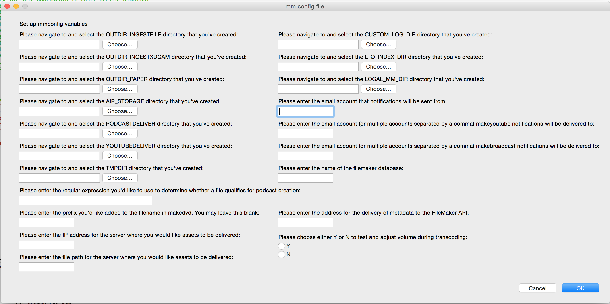

mediamicroservices documentation
==================

table of contents
-------------------

1. [summary](https://github.com/mediamicroservices/mm#summary)
	* [License](#license)
2. [installing and configuring mediamicroservices](https://github.com/mediamicroservices/mm#installing-and-configuring-mediamicroservices)
    1. [installing homebrew](https://github.com/mediamicroservices/mm#installing-homebrew)
    2. [installing mediamicroservices](https://github.com/mediamicroservices/mm#installing-mediamicroservices)
    3. [configuring mediamicroservices](https://github.com/mediamicroservices/mm#configuring-mediamicroservices)
        1. [variable explanations](https://github.com/mediamicroservices/mm#variable-explanations)
3. [Database Instructions](#database-instructions)
	1. [Database Configuration](#database-configuration)
	2. [Database Backup](#database-backup)
4. [mediamicroservices functions and instructions for use](https://github.com/mediamicroservices/mm#mediamicroservices-functions-and-instructions-for-use)
	* [aipupgrade](https://github.com/mediamicroservices/mm#aipupgrade)
    * [barcodeinterpret](https://github.com/mediamicroservices/mm#barcodeinterpret)
    * [blackatends](https://github.com/mediamicroservices/mm#blackatends)
    * [checksum2filemaker](https://github.com/mediamicroservices/mm#checksum2filemaker)
    * [checksumpackage](https://github.com/mediamicroservices/mm#checksumpackage)
    * [createpremisdb](#createpremisdb)
    * [finishpackage](https://github.com/mediamicroservices/mm#finishpackage)
    * [fix_left2stereo](https://github.com/mediamicroservices/mm#fix_left2stereo)
    * [fix_rewrap](https://github.com/mediamicroservices/mm#fix_rewrap)
    * [fix_volume](https://github.com/mediamicroservices/mm#fix_volume)
    * [ingestfile](https://github.com/mediamicroservices/mm#ingestfile)
    * [makebroadcast](https://github.com/mediamicroservices/mm#makebroadcast)
    * [makedvd](https://github.com/mediamicroservices/mm#makedvd)
    * [makefingerprint](https://github.com/mediamicroservices/mm/#makefingerprint)
    * [makeflv](https://github.com/mediamicroservices/mm#makeflv)
    * [makeframemd5](https://github.com/mediamicroservices/mm/#makeframemd5)
    * [makeframes](https://github.com/mediamicroservices/mm#makeframes)
    * [makelossless](https://github.com/mediamicroservices/mm#makelossless)
    * [makemetadata](https://github.com/mediamicroservices/mm#makemetadata)
    * [makemets](https://github.com/mediamicroservices/mm#makemets)
    * [makemp3](https://github.com/mediamicroservices/mm#makemp3)
    * [makepodcast](https://github.com/mediamicroservices/mm#makepodcast)
    * [makeprores](https://github.com/mediamicroservices/mm#makeprores)
    * [makeqctoolsreport]()
    * [makeresourcespace](https://github.com/mediamicroservices/mm#makeresourcespace)
    * [makeslate](https://github.com/mediamicroservices/mm#makeslate)
    * [makeyoutube](https://github.com/mediamicroservices/mm#makeyoutube)
    * [migratefiles](https://github.com/mediamicroservices/mm#migratefiles)
    * [qatesting](https://github.com/mediamicroservices/mm#qatesting)
    * [quickcompare](https://github.com/mediamicroservices/mm#quickcompare)
    * [removeDSStore](https://github.com/mediamicroservices/mm#removedsstore)
    * [restructureForCompliance](https://github.com/mediamicroservices/mm#restructureforcompliance)
    * [searchfingerprint](https://github.com/mediamicroservices/mm/#searchfingerprint)
    * [uploadomneon](https://github.com/mediamicroservices/mm#uploadomneon)
    * [verifytree](https://github.com/mediamicroservices/mm#verifytree)
    * [xdcamingest](https://github.com/mediamicroservices/mm#xdcamingest)

***

## summary

mediamicroservices have been developed for the purpose of processing audiovisual collections at [CUNY Television](http://cuny.tv). This repository includes scripts to run ffmpeg to create access and service copies of audiovisual assets, as well as to analyze, report, and deliver media as individual files or as Archive Information Packages. Mediamicroservices are written in Bash, and developed and tested for a macOS environment.

Mediamicroservices are installed and run using the terminal application, so knowledge of the command line is necessary. For information on the command line, please see [The Command Line Crash Course](http://cli.learncodethehardway.org/book/) or the [Code Academy Course](https://www.codecademy.com/learn/learn-the-command-line).

Please use the [issue tracker](https://github.com/mediamicroservices/mm/issues) to report any issues with installation and usage of mediamicroservices.

Please subscribe to this repository to receive updates about new releases and enhanced functionalities.

***

### License
This software and associated documentation is covered by the MIT license.  Details available [here](https://github.com/mediamicroservices/mm/blob/master/LICENSE.txt).

***

## installing and configuring mediamicroservices

### installing homebrew
before installing mediamicroservices, install homebrew to your computer. [here are directions for downloading homebrew](http://brew.sh/).
homebrew is a package manager that assists in managing all of the necessary components of mediamicroservices.

be sure to update/upgrade homebrew regularly.

to update the packages in homebrew, type: `brew update` into the command line. This command will tell you which packages need to be updated.

to upgrade the packages in homebrew, type: `brew upgrade` into the command line. This command will update all packages to their most recent version.

### installing mediamicroservices and dependencies
once homebrew has been installed, you can install mediamicroservices. First, use the [tap](https://github.com/Homebrew/homebrew/blob/master/share/doc/homebrew/brew-tap.md) command. Then, you can install.

Type `brew tap mediamicroservices/mm` into the command line.

Then, type `brew install mm` into the command line. This command will install mediamicroservices to your computer.

hooray, you've installed mediamicroservices!

mediamicroservices is dependent on other open source software to run. If you do not have the following software when installing mediamicroservices, homebrew will install it for you.

mediamicroservice dependencies:

* cowsay
* dvdrtools
* dvdauthor
* exiftool
* sdl
* ffmpeg --with-sdl2 --with-freetype
* flac
* ltopers (optional)
* hashdeep
* mediaconch
* mediainfo
* rsync
* tree
* xmlstarlet

mediamicroservices also uses Pashua to run a graphical user interface. It is recommended to install Pashua before running media microservices. Type `brew install Pashua` into the command line and press enter. You will be prompted for your password. Enter your password, and then you will be able to run mediamicroservices scripts and options that utilize a GUI (Graphical User Interface).

If at any point you would like to uninstall mediamicroservices, type `brew uninstall mm` into the command line.

### configuring mediamicroservices
In order for mediamicroservices to run, you must configure your variable settings. First, take a look at the list of variables below to get a sense of what each variable means. Then, create all of the delivery directories that you'll need, in the place you'd like them to be. You can name the directories themselves anything you'd like; the more important part is tying them to a variable in the configuration process. Not all variables are necessary for microservices to run, so look over which microservices you'd like to use to get a sense of whether or not you'll need to a specific variable.

Type `mmconfig` into the terminal to access the configuration GUI (or `mmconfig -t` for the CLI), which will take information input and save a file as mm.conf. This file will store your system variables.

mmconfig only has to be run once to create the configuration file, variables will be stored and can be changed by re-running mmconfig.

if you prefer to edit in the terminal, simply run mmconfig and follow the directions on screen. this option allows for you to also choose to edit the config file in nano or TextMate.

#### variable explanations

**1. edit config file in nano**
choose this option to edit the config file using [nano](http://www.nano-editor.org/)

**2. edit config file in TextMate**
choose this option to edit the config file using [TextMate](http://macromates.com/)

**3. OUTDIR_INGESTFILE**
set this variable to the processing directory. it is directory where your package will be created, and if you do not choose to deliver the package to AIP_STORAGE, this is where the completed package will remain.

**4. OUTDIR_INGESTXDCAM**
set this variable to the processing directory for xdcam files that are processed using using the mediamicroservices xdcamingest.

**5. OUTDIR_PAPER**
set this variable to the processing directory when using the paperingest script.

**6. AIP_STORAGE**
set this variable to the directory where the archival information package is delivered.

**7. PODCASTDELIVER**
set this variable to the directory where your podcast access copy is delivered.

**8. YOUTUBEDELIVER**
set this variable to the directory where your youtube access copy is delivered.

**9. TMPDIR**
set this variable to a temporary directory. it is used in the uploadomneon microservice as a temporary place for a file to live before it is uploaded to the omneon server.

**10. REGEX4PODCAST**
this varible holds regular expressions that are queried when makepodcast is run, in order to determine if a file qualifies for podcast creation. If you want all of your files to qualify for podcast creation, enter a "." which matches (almost) any character. Learn more about [regex](https://en.wikipedia.org/wiki/Regular_expression).

**11. DVDLABELPREFIX**
this variable is for adding a set prefix to the filename for DVDs in makedvd. You may leave this variable blank if you do not want to have a prefix uniformly assigned.

**12. OMNEONIP**
this variable sets the IP address for delivery of files to the omneon server in uploadomneon and ingestfile. this variable can be set to the IP address of any server that you'd like to have the broadcast copy of your files delivered to.

**13. OMNEONPATH**
this variable is the file path to the specific directory you'd like assets to be delivered to on the omneon server.

**14. CUSTOM_LOG_DIR**
this variable is the directory that stores processing logs for all of the media microservices, and is used when the `_log` function is called. Consider creating a directory called mmlogs in your documents directory, and assigning it to this variable.

**15. LTO_INDEX_DIR**
this variable is the directory that stores the .schema files created when LTOs are mounted and written to. If you are not using LTO in your workflow, you do not need to create this variable. If you do use LTO in your workflow, consider creating a directory called LTO Indexes, to be housed in your documents directory, and assigning it to this variable.

**16. LOCAL_MM_DIR**
this variable is the directory that stores mediamicroservices scripts locally.

**17. EMAIL_FROM**
this variable is the email address that notifications will be sent from once processes have been completed. You may leave this variable blank if you do not want any notification emails sent once actions have been performed on files.

**18. MAKEYOUTUBE_DELIVERY_EMAIL_TO**
this variable is the email address (or addresses) that notifications will be sent to once makeyoutube has been run on a file.

**19. MAKEBROADCAST_DELIVERY_EMAIL_TO**
this variable is the email address (or addresses) that notifications will be sent to once makebroadcast has been run on a file.

**20. FILEMAKER_DB**
this variable stores the name of the FileMaker database that is used in checksum2filemaker to upload metadata from processed files to a FileMaker database. You may leave this variable blank if you do not use FileMaker.

**21. VOLADJUST**
This variable must be set to yes (Y) or no (N). If set to yes, volume will be run through a volume adjustment filter and adjusted accordingly during transcoding.

**22. PREMIS_DB**
This variable must be set to yes (Y) or no (N). If set to yes, database reporting for mm will be enabled.

**23. SQL_ERROR_EMAIL_TO**
This can be set to include an email address to recieve error reports for database insertion.

**24. PREMIS_PROFILE**
Enter the login path information for the database here. (Use the output supplied by the createpremisdb script, or create your own using mysql_config_editor).
** PREMIS_NAME**
Enter the name of the database used for mm reporting.
**26 PERCEPTUAL_HASH**
Set this to 1 (on) to enable the creation of perceptual hashes during the ingestfile process
**27. Quit**
if editing in the terminal, use this option to leave the configuration file editor.

***

## Database Instructions

Media Microservices can be integrated with a database for the capture of a variety of preservation metadata generated through the mm workflow. Currently the MM Database supports PREMIS event information, fixity information, perceptual hashes for video files, mediainfo output and ingest logs.

### Database specific scripts
* createpremisdb
* dbbackup
* makefingerprint
* searchfingerprint
* updatingplist

### Database Configuration

To configure the database, run the command `createpremisdb -c` on your __host__ computer and follow the prompts.  This will set up the database as well as facilitate user creation. To create users without creating a new database, use the command `createpremisdb -u`.  At the end of user creation, the script will supply a command to create a log-in profile for the database.  It should look something like this: `mysql_config_editor set --login-path=your_user_config --host=xx.xx.xxx.xxx --user=your_user --password`. Run this command on your __user__ computer and enter the password for the user you created when prompted.  This will create the SQL log-in profile that you will use when configuring the microservices. NOTE: When supplying the suggested command, the script does its best to auto-fill the host IP address.  You may wish to verify that this is the correct IP.

To finalize the database setup, run `mmconfig` (GUI mode) or `mmconfig -t` (CLI) and select 'Y' in the PREMIS Database logging section, (or set to Y if using CLI). Enter the database name and log-in profile you have created to finalize DB connectivity. Additional database options (such as fingerprint generation) can be set at this time.

### Database Backup
MM includes a script for database backup.  This can be either run manually or set up as an automated process.  After configuring the backup script, running `dbbackup` will create a zipped backup in the chosen location.  To automate this process use Brew Services.  Typing `brew services start mm` will cause the db to be backed up automatically using the included plist file.  By default, backups will occur daily at 2:00 AM.

To configure database backup use the command `dbbackup -e`. This will open the config file in a terminal editor. Set the neccessary variables to your desired values.

***

## mediamicroservices functions and instructions for use

For all microservices, the structure of the command looks like this:
`[microservice] -options [input]`
the microservice is the particular command you want to execute (for example, checksumpackage)
options are any non-default choices that the script may contain
the input is the package, directory, or file that you are working with

Across all mediamicroservices, you can always receive the usage information by typing the microservice and -h. Your command will look like this: `[microservice] -h`.

makepodcast, makebroadcast, makeflv, make prores, makeresourcespace, makeyoutube, and makedvd also share the following options:

* if you want to specify a directory for the file to be delivered to, use the -d option, and follow -d with the directory path. Your command will look like this: `[microservice] -d [directory/path] [input]`. This option delivers a copy of the resulting file to a specific location, in addition to the default OUTPUTDIR.
* if you want to specify a directory for the file to be written directly to, use -o. Your command will look like this: `[microservice] -o [directory/path] [input]`.
* if you want to run makebroadcast in "dry-run" mode, which means that the commands will be shown in the terminal but not run, use -n. Your command will look like this: `makebroadcast -n [input]`.
* if you want to send email notifications about the delivery of a file, and you set the email variables, you can use option e or E. option e will send an email about the delivery but only if -d is also used. Your command will look like this: `[microservice] -d [directory/path] -e [input]`. If you want to send an email about the process outcomes, use E. Your command will look like this: `[microservice] -E [input]`.

To view the specific ffmpeg encoding options for each file, view the sourcecode of the microservice directly on GitHub or using a text editor on your computer.

#### aipupgrade
* this script takes an archival information package created by earlier versions of ingestfile and removes the submissionDocumentation directory, removes .DS_Store files, logs the package type to the capture log if there is not one listed, and creates new technical metadata files that overwrite previously created metadata files. To use aipupgrade, type aipupgrade and drag in all the packages you wish to modify. Note that you will be asked to choose a package type and that will be assigned to all of the packages, so only drag in packages of one type of content. Your command will look like this: aipupgrade [package1] [package2]

#### barcodeinterpret
* barcodeinterpret works with xdcamingest to gather metadata about an XDCam disk by scanning the barcode on the disk case. this script is no longer in use and development is not supported.

#### blackatends
* blackatends reports on the number of black frames at the beginning and end of a video file. The report is output into the terminal window. Your command will look like this: `blackatends [file1] [file2]`

#### checksum2filemaker
* checksum2filemaker delivers checksums from a package input into a predefined table in a FileMaker Database called checksums, using the dfxml format. this script requires the user to set up a FileMaker database and server URL, which are both variables stored in the configuration file. To use this script, type checksum2filemaker in your command line, followed by the package, like this:  `checksum2filemaker [package]`

#### checksumpackage
* checksumpackage creates, and verifies checksums from an input of a directory or archival informaion package. To use, type checksumpackage into the command line, followed by the input:  `checksumpackage [input]`.
* If you only want to check that filenames and filesizes are the same as in existing files, use option -c. Type  `checksumpackage -c [input]` and if no existing checksum file exists, one will be created.
* Another option is to use -c in conjunction with -u, which will create new checksums and version the previous ones if the check is unsuccessful, meaning your checksums have changed. Type  `checksumpackage -cu [input]` for this option.
* Finally, use -v as an option if you want to fully verify checksums. If no checksums exist, the script will create the initial ones. Verification will version existing checksums by adding the date they were created to the filename and create new ones, and log the difference to a checksumprocess log, which will be placed in the metadata directory of the package. To use -v, type  `checksumpackage -v [input]`

#### createpremisdb
* createpremisdb will create a database for the logging of microservices information as well as facilitate user creation.  For more information on use, see the [database configuration](#configuring-premisfixity-logging-database) section of this readme.
* commands are `createpremisdb -c` for database creation and `createpremisdb -u` for user creation.

#### dbbackup
* Creates backups of selected database. Allows a user specified number of backups to be saved. Script can be run manually or set up as a recurring task using the `brew services start mm` command.

* Usage: -e edit configurations, -c create login credentials for backup -h help

#### finishpackage
* finishpackage is a combination of the microservices makelossless, makebroadcast, makeyoutube, makemetadata, and checksumpackage. The purpose is to losslessly transcode, create access copies, and create metadata and directory structure information for a file or package input. To use finishpackage, type finishpackage and drag your input into the command line: `finishpackage [input]`. finish package is typically used in conjunction with restructureForCompliance.

#### fix_left2stereo
* fix\_left2stereo takes an input video file or files and produces outputs that map the left channel of the input to a stereo mix in the output. The suffix "\_left2stereo" is added to the filename to distinguish it from the original. Your command will look like this: `fix_left2stereo [file1] [file2]`

#### fix_rewrap
* fix\_rewrap takes an input video file or files and produces outputs through re-multiplexing all tracks of the input into a new container. The suffix "\_rewrap" is added to the file name to distinguish it from the original. Your command will look like this: `fix_rewrap [file1] [file2]`

#### fix_volume
* fix_volume uses an input video file to produce an output video file where the audio is adjusted to meet an integrated loudness of -23dB. If the integrated loudness of the input is already within 1dB of the target then no change will occur. The output file will be in the same directory as the input file, and the suffix "\_voladj" is added to the file name to distinguish it from the original. Your command will look like this: `fix_volume [file1] [file2]`

#### ingestfile
* ingestfile is a combination of multiple microservices for the purposes of creating an Archival Information Package (AIP) from an input of a video file. Included in the AIP are the original file, access copies, and corresponding technical metadata. Running ingestfile also sets a unique identifier for a video file, and bases the directory and metadata naming on this unique identifier. to run ingestfile, you must have the following variables set: OUTDIR\_INGESTFILE, AIP_STORAGE, PODCASTDELIVER, YOUTUBEDELIVER. the default use of ingestfile runs the following processes on a file:
    * queries the user, via terminal prompt or command line, about audio mapping settings, cropping of the video, formula of the video, whether a slate should be created for the file, and whether the original file should be removed after successful ingest. ingestfile also has a queue function, which allows for the user to set up many files at a time.
	* note that if you do not choose a formula, ingestfile will ask you if you want to perform an interlacement test on the file. this should only be done if you have a concern that the file may have interlacement issues. ingestfile will not proceed until you choose an option. ingestfile also tests for black frames at the beginning and end of the file and requests in and out times if needed. finally, ingestfile will also test for the frame count, and if there is a discrepancy between the reported and actual framecount, it will prompt the operator to quit or proceed.
    * then sets up the structure of the AIP, writes out the input from the user queries to a log file, and uses rsync to move the original file into the objects directory.
    * transcodes a file for broadcast and delivers it to the omneon server.
    * creates access copies using makemp3, makeframes, makeyoutube, and makepodcast, and delivers youtube and podcast files.
    * creates metadata, checksums, and maps the directory's contents.
    * finishes by delivering the AIP to the specified AIP_STORAGE location.

* By default, ingestfile will run with a graphical user interface (GUI), to run it in terminal use option -e. Your command will look like:  `ingestfile -e [file]`
* if you are running ingestfile on digitized video files that have additional logs from digitization, and you need to set the in and out times for the file to be trimmed, you can use option -p. Your command will look like:  `ingestfile -p [file]`. This option does not have a GUI, so you will input information when prompted into the command line, including setting in and out times and dragging in any logs from digitization. Note that this option does not deliver to AIP storage, instead it keeps the AIP in the original directory.
* if you would like to create an AIP but not have the file delivered to the omneon server or any of the access copies delivered, you can use option -n. Your command will look like:  `ingestfile -n [file]`.
* if you would like to only deliver the AIP to the omneon server and AIP storage, you can use -i. Your command will look like:  `ingestfile -i [file]`.

* here's two gifs of ingestfile

#### makebroadcast
* makebroadcast creates a file suitable for broadcast or editing from the input of a file or package. Your command will look like this: `makebroadcast [input]`.
* if you would like to use only the left or right channel of first audio track, use options r or l. Your command will look like this:  makebroadcast -l [input] for left or  `makebroadcast -r [input]` for right.
* if you want to apply a formula that will override the defualt ffmpeg settings, use option F. Your command will look like this: `makebroadcast -F [formula] [input]`.
* if you want to run the video through a crop detection filter and crop the video during transcoding, use option c. Your command will look like this: `makebroadcast -c [input]`.
* if you want to run the video through a volume adjustment filter, then adjust the volume accordingly during transcoding, use option v. This process will be slower. Defaults to ${VOLADJUST} variable set in mmconfig. Your command will look like this: `makebroadcast -v Y` OR `N [input]`.
* makebroadcast has options d, o, n, e, E. To reread what those options mean, return to [section header](https://github.com/mediamicroservices/mm#mediamicroservices-functions-and-instructions-for-use).
    * If you use options o or d, your command will look like this: `makebroadcast -o OR -d [path/to/directory] [input]`.
    * If you use option n, your command will look like this: `makebroadcast -n [input]`.
    * If you use option e, your command will look like this: `makebroadcast -e -d [path/to/directory] [input]`. If you use option -E, your command will look like this: `makebroadcast -E [input]`.

#### makedvd
* makedvd creates a DVD .iso file from a video file or package input. Your command will look like makedvd [input]. A file run with no additional options will be a .iso file in a directory called access, which is created by the script in the same location as the file input. A package input run with no additional options will behave similarly, in that the access directory will be created inside the package (if it is not already there), and will hold the DVD .iso file.
* if you would like to use only the left or right channel of first audio track, your command will look like this: `makedvd -l [input]` for left or `makedvd -r [input]` for right.
* if you would like to add the DVDLABELPREFIX, which you set as a varible in mmconfig, you will want to use option v. Your command will look like this: `makedvd -v [input]`.
* makedvd has options d, o, n, e, E. To reread what those options mean, return to [section header](https://github.com/mediamicroservices/mm#mediamicroservices-functions-and-instructions-for-use).
    * If you use options o or d, your command will look like this: `makedvd -o` OR `-d [path/to/directory] [input]`.
    * If you use option n, your command will look like this: `makedvd -n [input]`.
    * If you use option e, your command will look like this: `makedvd -e -d [path/to/directory] [input]`.
    * If you use option -E, your command will look like this: `makedvd -E [input]`.

#### makefingerprint
* makefingerprint creates perceptual hashes from input video files and packages. It is also capable of reporting fingerprint information into a centralized database set up through mm.

#### makeflv
* makeflv creates a flash file from a video file or package input. Your command will look like this: `makeflv [input]`.
* makeflv has options d, o, n, e, E. To reread what those options mean, return to [section header](https://github.com/mediamicroservices/mm#mediamicroservices-functions-and-instructions-for-use).
    * If you use options o or d, your command will look like this: `makeflv -o` OR `-d [path/to/directory] [input]`.
    * If you use option n, your command will look like this: `makeflv -n [input]`.
    * If you use option e, your command will look like this: `makeflv -e -d [path/to/directory] [input]`.
    * If you use option -E, your command will look like this: `makeflv -E [input]`.

#### makeframemd5
* Creates a frame md5 for video files in target package. Relies on package structure used in mm.

#### makeframes
* makeframes creates 10 still images from a video file or package input. Your command will look like:  makeframes [input]. To deliver still images to a specific directory, use this command  `ingestfile -d [path/to/directory] [input]`.

#### makelossless
* makelossless losslessly transcodes a video file or package input. Your command will look like this: makelossless [input].
* if you would like to transcode using lossless jpeg2000 instead of ffv1 version 3, use option j. Your command will look like this: `makelossless -j [input]`.
* if you want to run makelossless in "dry-run" mode, which means that the commands will be shown in the terminal but not run, use option n. Your command will look like this:  `makelossless -n [input]`.

#### makemetadata
* makemetadata produces a set of metadata reports, using ffprobe, mediainfo, and exiftool, for an archival information package on all files in the objects subdirectory. ffprobe reports are .xml and .json files, mediainfo reports are .xml and mediainfo trace reports are .txt, and exiftool reports are .xml and .txt. Your command will look like this: `makemetadata [input]`.

#### makemets
* makemets creates a mets.xml file that documents the structure of an archival information package created by ingestfile. The mets file also includes information from the dfxml file created in the makemetadata process.

#### makemp3
* makemp3 creates an mp3 file from a video file or package input. Your command will look like this: makemp3 [input].
* if you want to specify a directory for the file to be written directly to, use option o. Your command will look like this: `makemp3 -o [directory/path] [input]`

#### makepodcast
* makepodcast creates a Quicktime file that is suitable for podcasting from a video file or package input. Your command will look like this: makepodcast [input].
* makepodcast has options d, o, n, e, E. To reread what those options mean, return to [section header](https://github.com/mediamicroservices/mm#mediamicroservices-functions-and-instructions-for-use).
    * If you use options o or d, your command will look like this: `makepodcast -o OR -d [path/to/directory] [input]`.
    * If you use option n, your command will look like this: `makepodcast -n [input]`.
    * If you use option e, your command will look like this: `makepodcast -e -d [path/to/directory] [input]`.
    * If you use option -E, your command will look like this: `makepodcast -E [input]`.

####  makeprores
* makeprores creates a prores/quicktime file from a video file or package input. Your command will look like this: makeprores [input].
* makeprores has options d, o, n, e, E. To reread what those options mean, return to [section header](https://github.com/mediamicroservices/mm#mediamicroservices-functions-and-instructions-for-use).
    * If you use options o or d, your command will look like this: `makeprores -o` OR `-d [path/to/directory] [input]`.
    * If you use option n, your command will look like this: `makeprores -n [input]`.
    * If you use option e, your command will look like this: `makeprores -e -d [path/to/directory] [input]`.
    * If you use option -E, your command will look like this: `makeprores -E [input]`.

#### makeresourcespace
* makeresourcespace creates a high quality h264 file from a video file or package input. Your commmand will look like this: uploadyoutube [input].
* if you would like to use only the left or right channel of first audio track, use options r or l. Your command will look like this: makeresourcespace -l [input] for left or makeresourcespace -r [input] for right.
* if you want to run the video through a volume adjustment filter, then adjust the volume accordingly during transcoding, use option v. This process will be slower. Defaults to ${VOLADJUST} variable set in mmconfig. Your command will look like this: makeresourcespace -v Y OR N [input].
* makeresourcespace has options d, o, n, e, E. To reread what those options mean, return to [section header](https://github.com/mediamicroservices/mm#mediamicroservices-functions-and-instructions-for-use).
    * If you use options o or d, your command will look like this: `makeresourcespace -o OR -d [path/to/directory] [input]`.
    * If you use option n, your command will look like this: `makeresourcespace -n [input]`.
    * If you use option e, your command will look like this: `makeresourcespace -e -d [path/to/directory] [input]`.
    * If you use option -E, your command will look like this: `makeresourcespace -E [input]`.

#### makeslate
* makeslate creates a slate to be inserted before a broadcast program begins. To use makeslate at your own institution, you will have to manually edit the file based on your institutional needs. makeslate writes a short .mov file to your desktop. to run makeslate, your command will look like this: `makeslate [input]`.

#### makeyoutube
* makeyoutube creates a high quality h264 file from a video file or package input. Your command will look like this: `makeyoutube [input]`.
* if you would like to use only the left or right channel of first audio track, use options r or l. Your command will look like this: `makeyoutube -l [input]` for left or `makeyoutube -r [input]` for right.
* if you want to run the video through a volume adjustment filter, then adjust the volume accordingly during transcoding, use option v. This process will be slower. Defaults to ${VOLADJUST} variable set in mmconfig. Your command will look like this: `makeyoutube -v Y` OR `N [input]`.
* makeyoutube has options d, o, n, e, E. To reread what those options mean, return to [section header](https://github.com/mediamicroservices/mm#mediamicroservices-functions-and-instructions-for-use).
    * If you use options o or d, your command will look like this: `makeyoutube -o` OR `-d [path/to/directory] [input]`.
    * If you use option n, your command will look like this: `makeyoutube -n [input]`.
    * If you use option e, your command will look like this:` makeyoutube -e -d [path/to/directory] [input]`.
    * If you use option -E, your command will look like this: `makeyoutube -E [input]`.

#### migratefiles
* migratefiles is a script that uses rsync to move files, and creates a log documenting the checksum, time, and file paths of files migrated. migratefiles expects a directory input. To use migrate files, type the command `migratefiles -o [destination] [input]`

#### qatesting
* QA testing performs a series on tests on one or multiple video inputs and outputs the results into the terminal. Your command will look like this: `qatesting [input] [input1] [input2]`

#### quickcompare
* quickcompare takes two files and compares the checksums against one another, and outputs the results into the terminal. Your command will look like this: `quickcompare [input1] [input2]`

#### removeDSStore
* removeDSStore is a script to remove hidden .DS\_Store files from a package input. Your command will look like this: `removeDSStore [input]`

#### restructureForCompliance
* restructureForCompliance is a script that takes one or multiple directory or file input and creates an archival information directory structure.
* If the input is a file, the script creates an upper level directory named by the media ID, named with the same name as the input file, and within that an objects directory and a metadata directory. The metadata directory contains a fileMeta folder and a logs folder. The script also moves the input file into the objects directory.
* If the input is a directory, the script creates the objects and metadata directory within the input directory, as well as a fileMeta and logs directory within the metadata directory. The script also moves the input file into the objects directory.
* Your command will look like this: `restructureForCompliance [file or directory input] [file or directory input 2]`

#### searchfingerprint
* Generates fingerprints (perceptual hashes) from whole or specified portion of an input video file and compares them against fingerprints stored in the mm database. Outputs any detected matches in 500 frame segments both in the terminal and in an optional preview window. Preview window will attempt to locate the portions of input video for which matches were found.
* Usage: "searchfingerprint" [ -h ] (help) [ -i ] (set in time) [ -o ] (set out time) [ -t ] (text only-don't display video preview)

#### uploadomneon
* uploadomneon uploads a file or group of files, in sequential order, to a server using rsync. Although the script is called uploadomneon because that is the name of the server at CUNY Television, it can be set to any server and directory path in mmconfig. To run uploadomneon, the server IP address, path, and tmpdir variables must be set. Your command will look like this: `uploadomneon [input1] [input2]`

#### verifytree
* verifytree uses a series of xpath statements and the tree.xml document created by maketree to validate the contents of an Archival Information Package. verifytree outputs mismatches and unexpected items found in AIPs into the terminal window. It must be used in conjunction with maketree. Your command will look like: `verifytree [package]`.

#### xdcamingest
* xdcamingest performs ingest of files read from an XDCam disk. the script will prompt the user via the command line for values, and write output to an operator log, and create access copies of xdcamfiles. this script is no longer in use and development is not supported.
